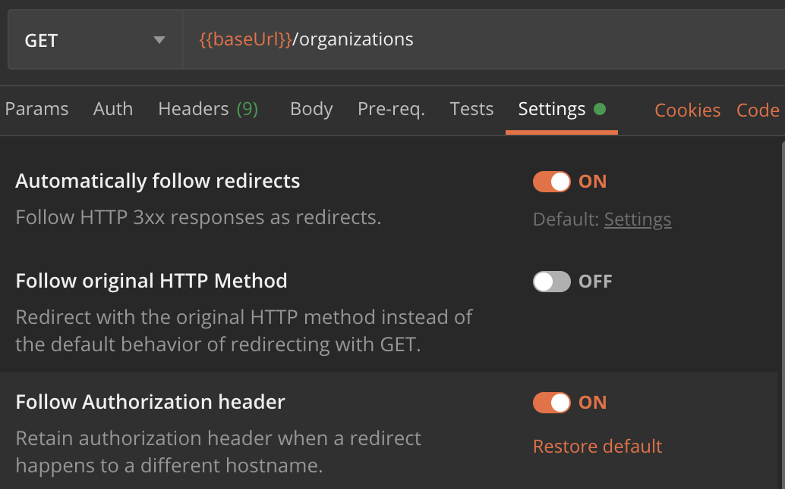
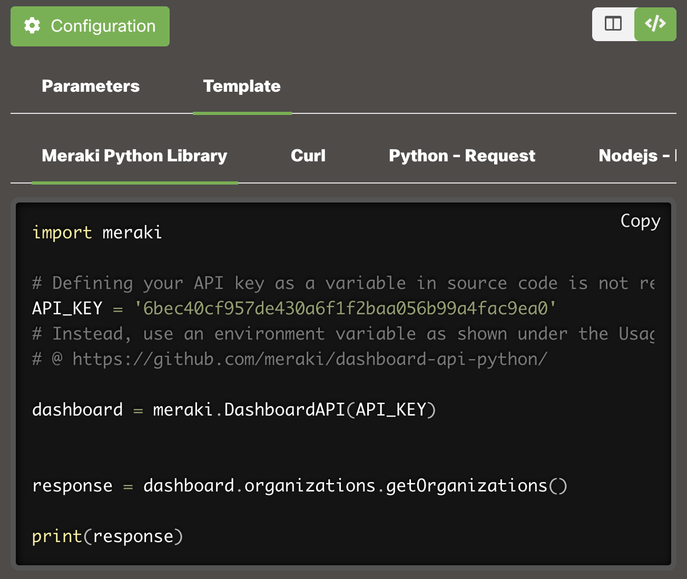

# Authorization

## Access methods

There are two forms of authentication and authorization for dashboard API:

* **App-scoped access** - Uses OAuth 2.0 grants
* **Admin-scoped access** - Uses API keys

### Choosing the right authentication method

| Feature            | OAuth 2.0 Grants                                        | API Keys                               |
| ------------------ | ------------------------------------------------------- | -------------------------------------- |
| **Best for**       | Third-party applications, organization-wide automation  | Personal scripts, admin-specific tasks |
| **Scope**          | App-scoped with granular permissions                    | Admin-scoped based on user role        |
| **Permissions**    | Configurable per application                            | Inherits from admin's role             |
| **Identity**       | Application identity                                    | Admin identity                         |
| **Management**     | Organization level                                      | Individual admin level                 |
| **Token lifetime** | 60 minutes (auto-refresh)                               | Permanent until revoked                |

### App-scoped access: OAuth 2.0 grants

Developers can register their applications to enable OAuth-powered auth grants. This access is app-scoped, managed at the organization level, and can be managed by any admin in an organization with the appropriate permissions. OAuth is typically used with applications that should have a [specific set of permissions](OAuthScope.md) across an entire dashboard organization and not necessarily operate on behalf of any one admin. For more on OAuth, please read [our OAuth documentation](OAuth.md).

### Admin-scoped access: API keys

API keys operate on behalf of the identity that owns them, and are often used when API permissions should be determined by the admin's role in a given organization. Unlike an OAuth grant, admin-scoped access maintains admin context in all API operations.

A Meraki identity has an email address, a password, and, potentially, 2FA registration and/or API keys. This record can be re-used across organizations if an existing admin in an organization with the appropriate permissions grants the identity an admin record in that organization.

Each identity can have have up to two valid API keys at a time regardless of their org membership(s). 

#### API key management

Each identity manages its own API keys, just like it manages its own password and 2FA registration. If an identity has been added to an organization as an admin, then their API key(s) will have access to that organization according to the admin's role in that organization. For example,

* If an identity is a full org admin in Org1, then their API key(s) will have the same permissions in Org1.
* If an identity has limited admin permissions in Org2, then their API key(s) will have the same limited permissions in Org2.
* Admins can belong to multiple organizations at a time (e.g., Org1 and Org2) and have different permissions in each organization.

##### Obtaining your API key

> **Note:** These steps presume you have already created your own organization or been granted an admin role in an existing organization.

1. Sign in to your Meraki dashboard: <https://dashboard.meraki.com>
2. Navigate to `Organization` > `API & Webhooks` from the left nav.
3. Select `API keys and access` from the top tabs.

This page lists your personal API keys, if any. You have the option to revoke your own or generate yourself a new one.

> **⚠️ Security Best Practice**
>
> Treat your API key like a password. Never commit it to source code or share it publicly. Store it in environment variables or secure credential management systems.

## Bearer Auth

Dashboard API v1 supports Bearer Auth using the standard `Authorization` header parameter. The value will be a string that begins with the word `Bearer`, followed by your Meraki API key or [OAuth credentials](OAuth.md).

**Example header:**

```json
{
 "Authorization": "Bearer <API_KEY>"
}
```

**Example cURL request:**

```bash
curl https://api.meraki.com/api/v1/organizations \
  -L -H 'Authorization: Bearer {API_KEY}'
```

**Example Python usage:**

```python
# Example 1: Best practice
# This example will read the local environment variable `MERAKI_DASHBOARD_API_KEY`
# so that you don't have to add it to your source code. Please see below for
# setting up environment variables.
import meraki
dashboard = meraki.DashboardAPI()

# Example 2: Riskier
# Defining your API key as a variable in source code is not recommended. Please
# consult the below regarding best practices.
import meraki
API_KEY = '6bec40cf957de430a6f1f2baf056b99a4fac9ea0'  # Example API key
dashboard = meraki.DashboardAPI(API_KEY)
```

### Setting up environment variables

> **Note:** When developing scripts with an API key, it's a best practice to create a local environment variable `MERAKI_DASHBOARD_API_KEY` and set it to your API key, so that you can omit it from your source code.

**Linux/macOS:**

```bash
export MERAKI_DASHBOARD_API_KEY="your_api_key_here"
```

**Windows (PowerShell):**

```powershell
$env:MERAKI_DASHBOARD_API_KEY="your_api_key_here"
```

**Windows (Command Prompt):**

```cmd
set MERAKI_DASHBOARD_API_KEY=your_api_key_here
```

### Troubleshooting

If you get a 401 Unauthorized error (with message _"Missing API key"_) when using dashboard API v1 with Bearer token, check the following to troubleshoot:

1. As an example, when using your API key to retrieve the [GET /organizations](##!get-organizations) operation, you should see the same data as shown when navigating to [https://api.meraki.com/api/v1/organizations](https://api.meraki.com/api/v1/organizations) in your browser, using an authenticated session with the credentials that generated the API key.

2. Next, check that your API call has the correct header with the following (and not v0's `X-Cisco-Meraki-API-Key`):

```JSON
Authorization: Bearer {API_KEY}
```

3. If making the API call in cURL, check that the **--location-trusted** flag is included.

4. If making the API call in Postman, check that the setting “_Follow Authorization header_” is enabled.


5. If using the [Python library](pythonLibrary.md), authorization is handled automatically, so assuming the right API key is supplied, the Python code snippet for [getOrganizations](##!get-organizations) > _Template_ > _Meraki Python Library_ will work w/ the v1 library installed.


6. If you really want to write your own functions in Python, then you will need to define a new instance of the **requests.Session** class that does not _rebuild_auth_ upon a redirect. For example:

```python
from requests import Session
class NoRebuildAuthSession(Session):
    def rebuild_auth(self, prepared_request, response):
      '''
      No code here means requests will always preserve the Authorization header when redirected.
      Be careful not to leak your credentials to untrusted hosts!
      '''
session = NoRebuildAuthSession()
API_KEY = '6bec40cf957de430a6f1f2baf056b99a4fac9ea0'  # Example API key
response = session.get('https://api.meraki.com/api/v1/organizations/', headers={'Authorization': f'Bearer {API_KEY}'})
print(response.json())
```

7. If using PowerShell with **Invoke-RestMethod**, make sure that the _-PreserveAuthorizationOnRedirect_ flag is included.

8. The behavior here is standard and due to API clients like cURL and Postman stripping the Authorization header, for security purposes, when following an HTTP redirect.
