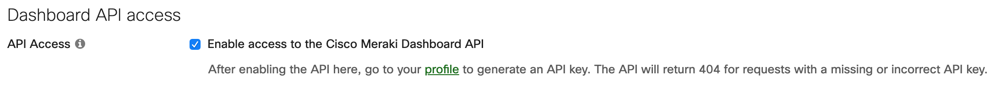

## Authorization

The Meraki Dashboard API requires a header parameter of `X-Cisco-Meraki-API-Key` to provide authorization for each request.
 
```json
{
	"X-Cisco-Meraki-API-Key": <Meraki_API_Key>
}
```

```curl
curl https://api.meraki.com/api/v1/organizations \
  -H 'X-Cisco-Meraki-API-Key: {MERAKI-API-KEY}'
```

```Python
import meraki

# Defining your API key as a variable in source code is not recommended
API_KEY = '6bec40cf957de430a6f1f2baa056b99a4fac9ea0'
dashboard = meraki.DashboardAPI(API_KEY)

# Instead, use an environment variable, for example:
# export MERAKI_DASHBOARD_API_KEY=6bec40cf957de430a6f1f2baa056b99a4fac9ea0
dashboard = meraki.DashboardAPI()
```

## Obtaining your Meraki API key

In order to interact with the Dashboard API, you must first obtain an API key.

- Open your Meraki dashboard: https://dashboard.meraki.com
- Once logged in, navigate to the _Organization > Settings_ page.
- Ensure that the API Access is set to “Enable access to the Cisco Meraki Dashboard API”



Then go to your profile by clicking on your account email address (on the upper-right) _> My profile_ to generate the API key.

> save this key in a secure location, as it represents your admin credentials


## Authorization with Bearer Token (beta)

The Dashboard API v1 also supports Bearer authentication using the standard `Authorization` header parameter. The value will a string beginning with the word `Bearer ` followed by your Meraki API key.

*Note: This authorization method is in beta*

 
```json
{
	"Authorization": Bearer <API_KEY>
}
```

```cURL
curl https://api.meraki.com/api/v1/organizations \
  -L -H 'Authorization: Bearer {API_KEY}'
```

### Troubleshooting

If you're get a 401 Unauthorized error (with message _"Missing API key"_) when using dashboard API v1, check the following to troubleshoot:

1. As an example, when using your API key to retrieve the [GET /organizations](##!get-organizations) endpoint, you should see the same data as shown when navigating to [https://api.meraki.com/api/v1/organizations](https://api.meraki.com/api/v1/organizations) in your browser, using an authenticated session with the credentials that generated the API key.

2. Next, check that your API call has the correct header with the following (and not v0's `X-Cisco-Meraki-API-Key`):
```json
Authorization: Bearer {API_KEY}
```

3. If making the API call in cURL, check that the **--location-trusted** flag is included.

4. If making the API call in Postman, check that the setting “_Follow Authorization header_” is enabled.


5. If using the [Python library](pythonLibrary.md), authorization is handled automatically, so assuming the right API key is supplied, the Python code snippet for [getOrganizations](##!get-organizations) > _Template_ > _Meraki Python Library_ will work w/ the v1 library installed.


6. If you really want to write your own functions in Python, then you will need to define a new instance of the **requests.Session** class that does not _rebuild_auth_ upon a redirect. For example:
```python
from requests import Session
class NoRebuildAuthSession(Session):
    def rebuild_auth(self, prepared_request, response):
      '''
      No code here means requests will always preserve the Authorization header when redirected.
      Be careful not to leak your credentials to untrusted hosts!
      '''
session = NoRebuildAuthSession()
API_KEY = '6bec40cf957de430a6f1f2baa056b99a4fac9ea0'
response = session.get('https://api.meraki.com/api/v1/organizations/', headers={'Authorization': f'Bearer {API_KEY}'})
print(response.json())
```

7. If using PowerShell with **Invoke-RestMethod**, make sure that the _-PreserveAuthorizationOnRedirect_ flag is included.

8. The behavior here is standard and due to API clients like cURL and Postman stripping the Authorization header, for security purposes, when following an HTTP redirect. Another option without handling redirects is to use the reverse proxy base URL of https://api-mp.meraki.com/api/v1/ (with **-mp** added for this mega-proxy).