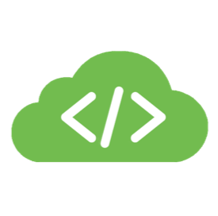

# Meraki Dashboard API

A RESTful API to programmatically manage and monitor Meraki networks at scale.



## What's New in v1 

The Dashboard API has evolved significantly, providing hundreds of endpoints to manage your Meraki networks!

We want to do so much more. But in order for us to include many of these new featues or improvements, we need to break a few things. 

The focus of this version is on **Simplicity** and **Scale**, by providing an enjoyable developer experience. 

The API documentation, Postman Collection and Python library will remain synced and up-to-date with improved navigation and features.

In addition, several improvements and new endpoints have been included with this major release.


### API Documentation

The API Endpoint documentation and complimenting Postman Collection have a new folder structure for navigating the API. 

> - General
>    - devices
>    - networks
>    - organizations
> - Products
>    - appliance
>    - camera
>    - cellularGateway
>    - insight
>    - sm
>    - switch
>    - wireless


#### Categories

The services are grouped into categories. This will provide a focused set of resources when building read-only dashboards (**MONITOR**), or automation scripts (**CONFIGURE**).


> - appliance
>    - **CONFIGURE**
>        - firewall         
>    - **MONITOR**
>        - performance

### Resource Path changes

The endpoint URL paths will always contain the Meraki product if required, reducing ambiguity when working with resources that have similar yet unique functionality. 

> *Examples of a product and service*
>
> `/appliance/ports`
>
> `/switch/ports`


### Authorization

The API calls will now use an Authorization Bearer token, per industry standards.

**Request Header**

```json
{
    "Authorization": Bearer <Meraki_API_Key>
}
```

### Base URI

Minor but important detail, the Base URI has change to **v1**

> `https://api.meraki.com/api/v1`


### See all the changes

Visit the [Changelog](https://developer.cisco.com/meraki/whats-new/#!v1-0-0-beta-0) for all the details.

### SDKs

Going forward, the custom Meraki Python library will be the recommended SDK for simplified API scripting. The previously auto-generated Python, Node & Ruby SDKs for **v0** will remain in the Meraki GitHub but will no longer be maintained. 

#### Python

The Meraki [Python Library](..#!python) has been updated to take advantage of all the new enhancements!


## What can the Dashboard API be used for?

- Add new organizations, admins, networks, devices, VLANs, and more
- Configure thousands of networks in minutes
- On-board and off-board new employees’ teleworker setup automatically
- Build your own dashboard for store managers, field techs, or unique use cases

Checkout out the [Explore](https://developer.cisco.com/meraki/explore/) section for open source projects, or browse the [Marketplace](https://apps.meraki.io/) for partner solutions.