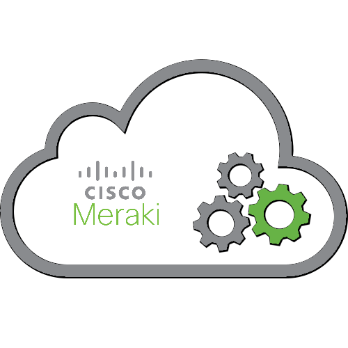

# Meraki Dashboard API

A RESTful API to programmatically manage and monitor Meraki networks at scale.

### What can the Dashboard API be used for?

- Add new organizations, admins, networks, devices, VLANs, and more
- Configure thousands of networks in minutes
- On-board and off-board new employees’ teleworker setup automatically
- Build your own dashboard for store managers, field techs, or unique use cases

Checkout out the [Explore](https://developer.cisco.com/meraki/explore/) section for open source projects, or browse the [Marketplace](https://apps.meraki.io/) for partner solutions.