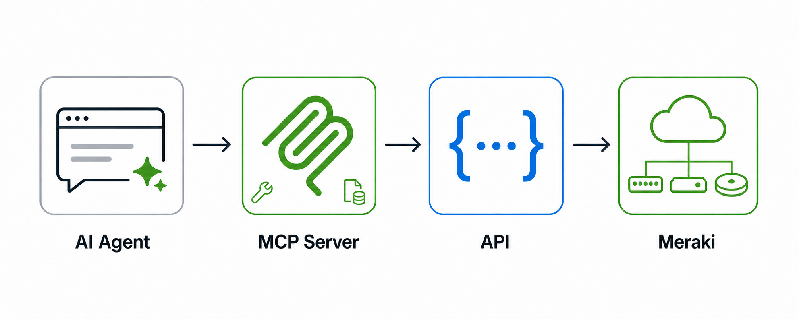

# Meraki MCP Server



The Meraki MCP server connects AI agents and coding assistants directly to the Meraki Dashboard API, enabling natural language queries and agentic network automation through a standardized interface.

Use it to build agents that answer questions about your network, generate reports, troubleshoot connectivity issues, and audit configurations - without writing custom API integration code.

> **Beta notice:** Meraki MCP is currently in beta. Features, tool schemas, supported API capabilities, and client configuration may change, including in ways that are not backward compatible. We reserve the right to make breaking changes during the beta period in order to incorporate feedback and improvements.

---

## What Is MCP?

[Model Context Protocol (MCP)](https://modelcontextprotocol.io/) is an open standard for connecting AI agents to external tools and data sources. MCP lets AI clients like Claude, Cursor, and VS Code Copilot call structured tools at runtime, so agents can read live data instead of relying on training knowledge alone.

The Meraki MCP server implements this standard for the Meraki Dashboard API. Your AI agent calls MCP tools; the server translates those calls into authenticated Meraki API requests and returns the results.

---

## Choose Your Meraki MCP Deployment

Meraki MCP is available as a Cisco-hosted remote service or as a self-hosted, open-source server. Both provide the same core MCP functionality; choose the deployment model that best fits your operational and compliance requirements.

| | Cisco-hosted remote MCP | Local, open-source MCP |
| --- | --- | --- |
| **Deployment** | Cisco hosts and manages the MCP server. Connect your client to [`https://mcp.meraki.com/mcp`](https://mcp.meraki.com/mcp). | Run the MCP server in your own environment. |
| **Core functionality** | Provides the Meraki MCP capabilities described in this guide. | Provides the same core Meraki MCP functionality. |
| **Meraki environments** | Supports Meraki.com only. Federal, GovCloud, and localized Meraki environments are not supported. | Can work with any Meraki environment. |
| **Code and customization** | Cisco manages the service and its implementation. | Review and customize the source code to meet your requirements. |
| **Setup and compatibility** | Follow the client configuration guidance below. | See [CiscoDevNet/cisco-meraki-mcp](https://github.com/CiscoDevNet/cisco-meraki-mcp-official/) for availability, setup, and compatibility details. |

> **Important:** You are responsible for any changes you make to the local, open-source MCP. Meraki does not support modified local MCP code.

---

## Meraki MCP Terms and Policy

Your use of the Cisco Meraki MCP Server and any Cisco API leveraged by the MCP Server is governed by the [Cisco Networking Model Context Protocol (MCP) Server Terms](https://www.thousandeyes.com/pdf/mcp-server-addendum.pdf), [Cisco Baseline API License Terms](https://www.cisco.com/c/dam/en_us/about/doing_business/legal/supplemental-terms/Baseline-API-Terms.pdf), [Cisco Acceptable Use Policy](https://www.cisco.com/c/dam/en_us/about/legal/cisco-acceptable-use-policy.pdf), [Cisco Meraki Cloud Service Offer Description](https://www.cisco.com/c/dam/en_us/about/doing_business/legal/OfferDescriptions/meraki.pdf), and [Cisco General Terms](https://www.cisco.com/c/dam/en_us/about/doing_business/legal/Cisco_General_Terms.pdf). 

---

## Prerequisites

- A Meraki Dashboard account
- A Meraki API key (generate one in **Dashboard → Organization → API & Webhooks**)
- An MCP-compatible client (Claude Desktop, Cursor, VS Code, etc.)

> **Warning**: The Meraki MCP server supports only read operations. However, AI agents are designed to be resourceful and may attempt to call the Meraki Dashboard API directly when they have access to an API key. 
> If the agent is given a read-write key, those direct API calls could make changes outside the MCP server. 
> Give the agent an API key associated with read-only Dashboard access to ensure it cannot make changes.

---

## MCP Server URL

```
https://mcp.meraki.com/mcp
```

---

## Authentication

The Meraki MCP server authenticates using a Meraki Dashboard API key passed as a bearer token.

```http
Authorization: Bearer <MERAKI_DASHBOARD_API_KEY>
```

---

## Client Configuration

Before adding the server in Cursor, VS Code, or Codex, set `MERAKI_DASHBOARD_API_KEY` in the environment used to launch that client. Restart the client after setting or changing the variable.

For example, in a terminal:

```bash
export MERAKI_DASHBOARD_API_KEY="your-meraki-dashboard-api-key"
```

### Claude Desktop

Claude Desktop does not support configuring remote MCP servers through `claude_desktop_config.json`. Add remote servers through **Settings → Connectors** instead. This flow currently supports unauthenticated and OAuth-based servers; an API-key-authenticated Meraki MCP connection is not yet supported in Claude Desktop.

### Claude Code

Add the following to your `.mcp.json`:

```json
{
  "mcpServers": {
    "meraki": {
      "type": "http",
      "url": "https://mcp.meraki.com/mcp",
      "headers": {
        "Authorization": "Bearer ${MERAKI_DASHBOARD_API_KEY}"
      },
      "env": {
        "MERAKI_DASHBOARD_API_KEY": "${MERAKI_DASHBOARD_API_KEY}"
      }
    }
  }
}
```

### Cursor

Add the following to your `.cursor/mcp.json`:

```json
{
  "mcpServers": {
    "meraki": {
      "url": "https://mcp.meraki.com/mcp",
      "headers": {
        "Authorization": "Bearer ${env:MERAKI_DASHBOARD_API_KEY}"
      }
    }
  }
}
```

### VS Code

Add the following to your `.vscode/mcp.json` to avoid hardcoding your API key:

```json
{
  "servers": {
    "meraki": {
      "type": "http",
      "url": "https://mcp.meraki.com/mcp",
      "headers": {
        "Authorization": "Bearer ${env:MERAKI_DASHBOARD_API_KEY}"
      }
    }
  }
}
```

### Codex

Add the following to your `~/.codex/config.toml`:

```toml
[mcp_servers.meraki]
url = "https://mcp.meraki.com/mcp"
bearer_token_env_var = "MERAKI_DASHBOARD_API_KEY"
```

---

## Tools

The MCP server exposes curated workflow tools rather than one tool per API endpoint. This keeps the tool surface small enough for AI clients to reason about effectively.

| Tool | Purpose |
| --- | --- |
| `semantic_search` | Search Meraki Dashboard API capabilities with a natural-language query and return ranked `capability_id` results. |
| `execute_api` | Execute a read-only Meraki Dashboard API capability selected from `semantic_search`. |

> **Tip:** Be specific in your prompts. The more context you give the agent about what you're looking for, the more precisely it can select and sequence the right tools.

---

## Example Use Cases

### Switch Port Stability Report

> "Generate a switch port stability report across the organization. Find switch ports with link flaps, STP changes, high error rates, or excessive packet loss in the last 7 days. Show the top 10 switches and ports by instability count, identify recurring issues, and recommend what to investigate first."

The agent calls `semantic_search` to find switch-event, port-status, and client capabilities, then calls `execute_api` for the selected capabilities to rank unstable ports and identify affected networks or devices.

### Wireless Client Experience Degradation Report

> "Generate a wireless client experience report for the organization. Identify where clients had poor performance, including low SNR, high retries, roaming, DHCP, DNS, and authentication failures. Show the top 5 networks and access points by impacted client count, highlight failure patterns, and recommend how to improve reliability."

The agent calls `semantic_search` to find wireless health, failed-connection, access-point, and SSID capabilities, then calls `execute_api` for the selected capabilities to identify and rank the affected networks and access points.

### WAN Health and Failover Report

> "Generate an MX WAN health report across the organization. Identify WAN uplink degradation, failovers, packet loss, latency spikes, jitter, and VPN interruptions over the last 30 days. Show the top 5 networks by impact, identify recurring failover or brownout behavior, and recommend how to improve resiliency."

The agent calls `semantic_search` to find appliance, uplink, connectivity-event, and VPN capabilities, then calls `execute_api` for the selected capabilities to identify affected sites, circuits, and recurring failure patterns.

### Switch Capacity and Oversubscription Report

> "Generate a switching capacity report across the organization. Identify switches, uplinks, and ports approaching capacity based on utilization, packet drops, errors, PoE usage, and client density. Highlight congestion or power-exhaustion risk, and recommend where upgrades, rebalancing, or configuration changes are needed."

The agent calls `semantic_search` to find switch-port, traffic, power, and client capabilities, then calls `execute_api` for the selected capabilities to identify capacity risk across networks, closets, and devices.

### Security Threat and Policy Effectiveness Report

> "Generate a security appliance threat and policy report across the organization. Analyze IDS/IPS events, malware and content-filtering blocks, AMP detections, and suspicious outbound traffic over the last 30 days. Show the top 5 networks by security event count, identify recurring threats or policy gaps, and recommend how to reduce risk."

The agent calls `semantic_search` to find security-event, appliance, client, and network capabilities, then calls `execute_api` for the selected capabilities to identify impacted networks, clients, and recurring security patterns.

---

## Rate Limits

The Meraki MCP server respects the [Meraki Dashboard API rate limits](https://developer.cisco.com/meraki/api-v1/rate-limit-overview/):

- **Default limit:** 10 requests per second per organization
- **Backoff behavior:** The server automatically retries with exponential backoff on `429 Too Many Requests` responses
- **Per-org isolation:** Rate limits are applied per organization; multi-org sessions do not share a single bucket

## IP Address Restrictions

This section applies to the Cisco-hosted remote MCP server. If your organization restricts the IP addresses from which Meraki Dashboard API calls can be made, add the following hosted MCP server egress IP addresses to your allowlist:

```
158.115.141.245
158.115.141.238
158.115.141.209
158.115.133.170
158.115.133.139
158.115.133.156
```

The local, open-source MCP server makes Dashboard API calls from the IP address of the environment where it is running. Allowlist that address according to your organization's requirements.

> **Important:** The hosted Meraki MCP server does not currently enforce your organization's Dashboard API IP restrictions. Requests made through the hosted MCP server appear to originate from the MCP server's IP address, so a user with a valid API key can make API calls through MCP even when their own IP address is not on the allowlist.
>
> Support for enforcing the same IP restrictions used for direct Dashboard API calls is planned, but is not currently available.

## Limitations (Current Release)

- **Read-only:** Write operations are not supported in the current release.
- **API key auth only:** OAuth is not yet supported; bearer token required.
- **Hosted MCP: Meraki.com only:** Federal, GovCloud, and localized Meraki environments are not supported by the Cisco-hosted MCP service. The local, open-source MCP can work with any Meraki environment.
- **IP restrictions:** Dashboard API IP restrictions are not enforced for requests made through the hosted MCP server. See [IP Address Restrictions](#ip-address-restrictions) for the required allowlist and local-MCP details.
