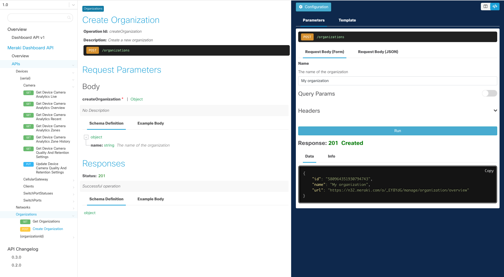

# Early API Access

An evolving set of in-development APIs for software developers interested in providing feedback on API feature design prior to general availability. Designed for use in testing environments where breaking API changes are acceptable. When enabled, all APIs are subject to breaking changes without prior notice. This feature can only be applied to the entire organization.

[Changelog](/meraki/whats-new/#!v1-beta) 

[GitHub](https://github.com/meraki/openapi/tree/v1-beta)

[Community](https://community.meraki.com/t5/Developers-APIs/bd-p/api)

# Interactive API Docs

Use the interactive documentation to explore the Meraki API endpoints. 

Each request will have a complete description of all the required parameters and also allow you to instantly try it out in the online console. Code Templates are also provided for quickly building scripts.

## API Key

- A demo API key is added by default to easily kick the tires.

- Add your own API key and parameter values in the **Configuration** menu to test against your own environment.

## API Version

