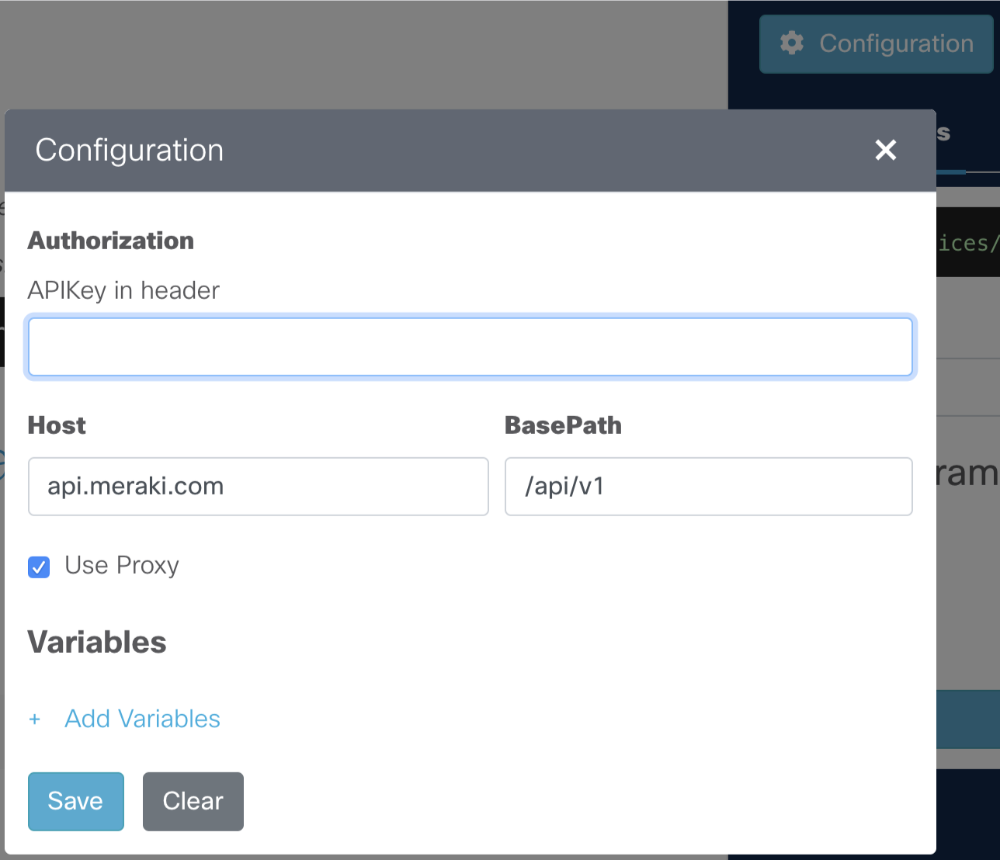

# Interactive API Docs

Use the interactive documentation to explore the Meraki API endpoints. 

Each request will have a complete description of all the required parameters and also allow you to instantly try it out in the online console. Code Templates are also provided for quickly building scripts.

## API Key

- A demo API key is added by default to quickly kick the tires.

- Add your own API key and paramater values in the **Configuration** menu

