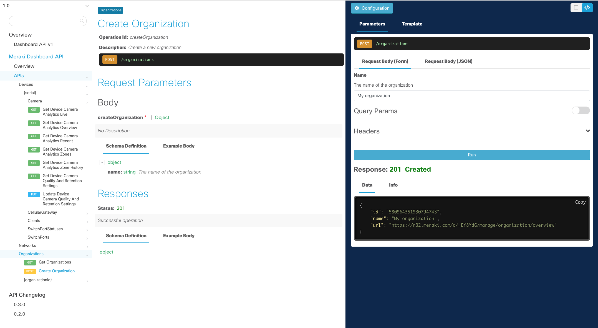

Use the interactive API docs to explore the Meraki API endpoints. 

- A sandbox API key is provided to quickly kick the tires.
- Add your own API key and paramater values in the **Configuration** menu

